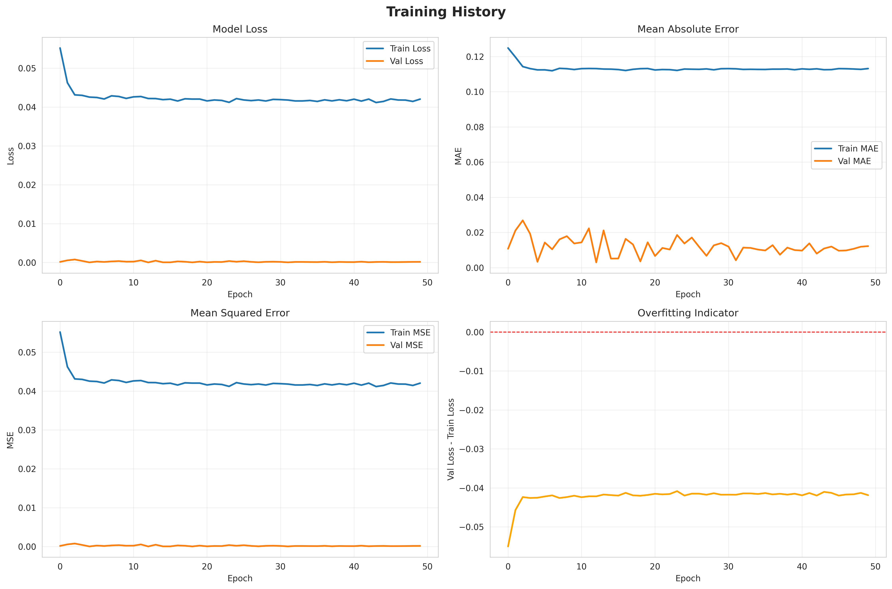
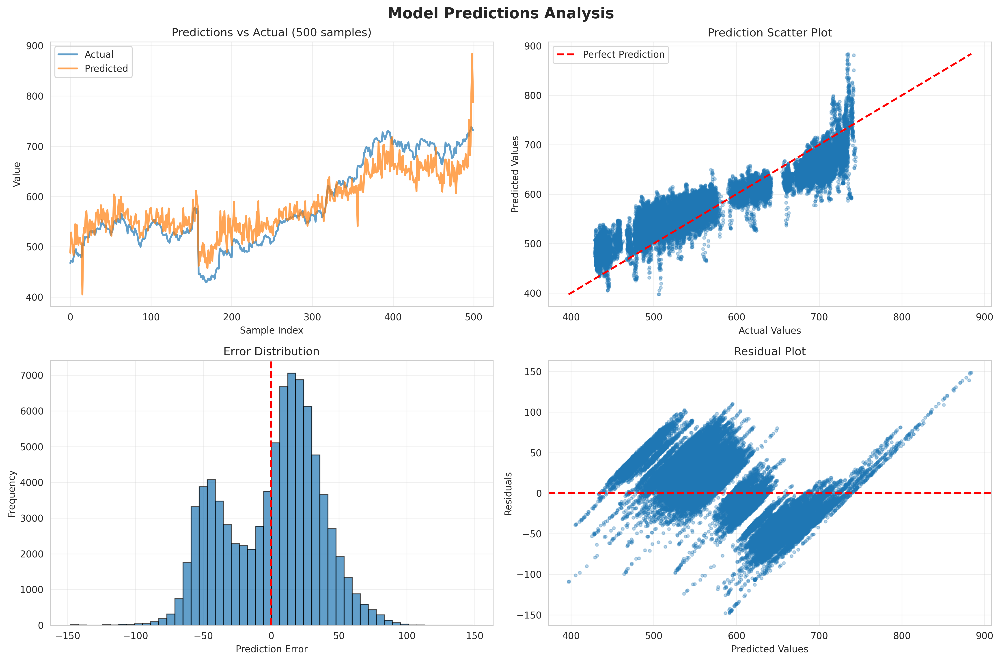
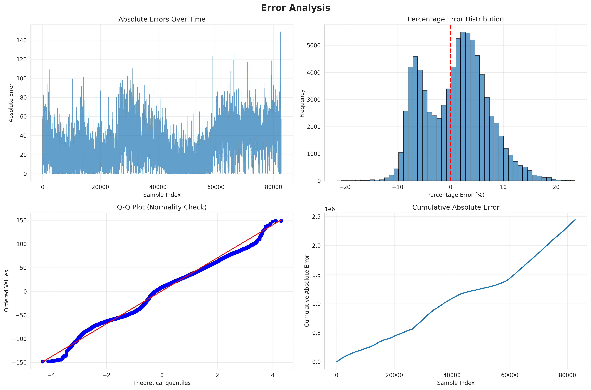

# LSTM Model Training Report

**Generated:** 2025-10-24 09:46:37  
**Run ID:** 20251024_082359  
**Duration:** 4958.07 seconds (82.63 minutes)  

---

## Executive Summary

### Model Performance

- **RMSE:** 35.302760
- **MAE:** 29.531633
- **MAPE:** 5.09%
- **R² Score:** 0.829740

## Training Configuration

### Model Architecture

- **Model Type:** stacked_lstm
- **LSTM Units:** [128, 64, 32]
- **Dense Units:** [16]
- **Dropout Rate:** 0.2
- **Recurrent Dropout:** 0
- **Batch Normalization:** False

### Training Parameters

- **Batch Size:** 64
- **Max Epochs:** 50
- **Actual Epochs Trained:** 50
- **Initial Learning Rate:** 0.001
- **Loss Function:** mse
- **Early Stopping Patience:** 100
- **Reduce LR Patience:** 7

### Features Used (20 features)

| # | Feature Name |
|---|-------------|
| 1 | open |
| 2 | high |
| 3 | low |
| 4 | close |
| 5 | volume |
| 6 | sma_5 |
| 7 | sma_10 |
| 8 | ema_7 |
| 9 | ema_11 |
| 10 | macd_line |
| 11 | macd_signal |
| 12 | atr_14 |
| 13 | momentum |
| 14 | bb_upper |
| 15 | bb_lower |
| 16 | vma_10 |
| 17 | volume_ratio |
| 18 | rsi_14 |
| 19 | price_change |
| 20 | price_change_pct |

## Training History

### Final Epoch Metrics

- **Training Loss:** 0.042025
- **Validation Loss:** 0.000155
- **Training MAE:** 0.113164
- **Validation MAE:** 0.012232

### Best Epoch: 13

- **Training Loss:** 0.042182
- **Validation Loss:** 0.000015
- **Training MAE:** 0.113150
- **Validation MAE:** 0.002976

## Visualizations

### Training History



### Predictions Analysis



### Error Analysis



## Detailed Test Metrics

```
RMSE: 35.302760
MAE: 29.531633
MAPE: 5.093626
R2: 0.829740
MEAN_ERROR: 1.090567
STD_ERROR: 35.285911
MAX_ERROR: 148.728369
MIN_ERROR: 0.000562
```

## Complete Training Log

```
✓ Log capture initialized: models/run_20251024_082359/training.log

► LOADING PREPROCESSED DATA
======================================================================
✓ Data arrays loaded successfully
  X_train shape: (385795, 60, 20)
  X_val shape: (82670, 60, 20)
  X_test shape: (82672, 60, 20)

  Data format:
    Sequence length: 60
    Number of features: 20
  ✓ Feature count matches expected: 20
✓ Scalers loaded (features + target)

  Validating feature columns...
  Expected features: 20
  Loaded features: 20
  ✓ All features validated correctly

  Features being used:
     1. open
     2. high
     3. low
     4. close
     5. volume
     6. sma_5
     7. sma_10
     8. ema_7
     9. ema_11
    10. macd_line
    11. macd_signal
    12. atr_14
    13. momentum
    14. bb_upper
    15. bb_lower
    16. vma_10
    17. volume_ratio
    18. rsi_14
    19. price_change
    20. price_change_pct

  Preprocessing configuration:
    Prediction horizon: 1
    Label type: regression
    Sequence length: 60

  Data Summary:
    Training samples: 385,795
    Validation samples: 82,670
    Test samples: 82,672
    Total samples: 551,137

► BUILDING MODEL
======================================================================
Model type: stacked_lstm
Input shape: (60, 20)
LSTM units: [128, 64, 32]
Dense units: [16]
Dropout rate: 0.2
Recurrent dropout: 0

✓ Model compiled successfully
  Optimizer: Adam (lr=0.001)
  Loss: mse
  Total parameters: 138,657

Model Architecture:
Model: "sequential"
┏━━━━━━━━━━━━━━━━━━━━━━━━━━━━━━━━━┳━━━━━━━━━━━━━━━━━━━━━━━━┳━━━━━━━━━━━━━━━┓
┃ Layer (type)                    ┃ Output Shape           ┃       Param # ┃
┡━━━━━━━━━━━━━━━━━━━━━━━━━━━━━━━━━╇━━━━━━━━━━━━━━━━━━━━━━━━╇━━━━━━━━━━━━━━━┩
│ lstm (LSTM)                     │ (None, 60, 128)        │        76,288 │
├─────────────────────────────────┼────────────────────────┼───────────────┤
│ dropout (Dropout)               │ (None, 60, 128)        │             0 │
├─────────────────────────────────┼────────────────────────┼───────────────┤
│ lstm_1 (LSTM)                   │ (None, 60, 64)         │        49,408 │
├─────────────────────────────────┼────────────────────────┼───────────────┤
│ dropout_1 (Dropout)             │ (None, 60, 64)         │             0 │
├─────────────────────────────────┼────────────────────────┼───────────────┤
│ lstm_2 (LSTM)                   │ (None, 32)             │        12,416 │
├─────────────────────────────────┼────────────────────────┼───────────────┤
│ dropout_2 (Dropout)             │ (None, 32)             │             0 │
├─────────────────────────────────┼────────────────────────┼───────────────┤
│ dense (Dense)                   │ (None, 16)             │           528 │
├─────────────────────────────────┼────────────────────────┼───────────────┤
│ dropout_3 (Dropout)             │ (None, 16)             │             0 │
├─────────────────────────────────┼────────────────────────┼───────────────┤
│ dense_1 (Dense)                 │ (None, 1)              │            17 │
└─────────────────────────────────┴────────────────────────┴───────────────┘
 Total params: 138,657 (541.63 KB)
 Trainable params: 138,657 (541.63 KB)
 Non-trainable params: 0 (0.00 B)

► TRAINING MODEL
======================================================================
Batch size: 64
Max epochs: 50

Starting training...
✓ Callbacks created
  Early stopping patience: 100
  Reduce LR patience: 7
  Model checkpoint: models/run_20251024_082359/best_model.h5
Epoch 1/50

and so on until epoch 50:

Epoch 50: val_loss did not improve from 0.00001

6029/6029 ━━━━━━━━━━━━━━━━━━━━ 93s 15ms/step - loss: 0.0421 - mae: 0.1131 - mse: 0.0421 - val_loss: 1.5457e-04 - val_mae: 0.0122 - val_mse: 1.5457e-04 - learning_rate: 1.5625e-05
Restoring model weights from the end of the best epoch: 13.

✓ Training complete
  Total time: 4903.91 seconds (81.73 minutes)
  Epochs trained: 50
  Best val_loss: 0.000015

► EVALUATING MODEL
======================================================================
✓ Predictions denormalized using target scaler

✓ Evaluation complete

Test Set Metrics:
  RMSE: 35.302760
  MAE: 29.531633
  MAPE: 5.09%
  R² Score: 0.829740

Error Statistics:
  Mean Error: 1.090567
  Std Error: 35.285911
  Max Error: 148.728369
  Min Error: 0.000562

► GENERATING PLOTS
======================================================================
✓ Training history plot saved: models/run_20251024_082359/images/training_history.png
✓ Predictions plot saved: models/run_20251024_082359/images/predictions_analysis.png
✓ Error analysis plot saved: models/run_20251024_082359/images/error_analysis.png

► SAVING MODEL AND RESULTS
======================================================================
✓ Full model saved: models/run_20251024_082359/final_model.h5
✓ Model architecture saved: models/run_20251024_082359/model_architecture.json
✓ Model weights saved: models/run_20251024_082359/model_weights.weights.h5
✓ Model summary saved: models/run_20251024_082359/model_summary.txt
✓ Test metrics saved: models/run_20251024_082359/test_metrics.csv
✓ Feature columns saved: models/run_20251024_082359/features_used.csv
✓ Training configuration saved: models/run_20251024_082359/training_config.csv
✓ Full training history saved: models/run_20251024_082359/full_training_history.csv

✓ All files saved successfully!

► GENERATING MARKDOWN REPORT
======================================================================
```

## Files Generated

### Model Files
- `final_model.h5` - Complete trained model
- `best_model.h5` - Best model checkpoint
- `model_weights.h5` - Model weights only
- `model_architecture.json` - Model architecture
- `model_summary.txt` - Model summary

### Data Files
- `test_metrics.csv` - Test set metrics
- `features_used.csv` - List of features
- `training_config.csv` - Training configuration
- `full_training_history.csv` - Epoch-by-epoch history
- `training.log` - Complete console output

### Visualization Files
- `images/training_history.png`
- `images/predictions_analysis.png`
- `images/error_analysis.png`

## Next Steps

1. Review the visualizations above to assess model performance
2. Check `full_training_history.csv` for epoch-by-epoch analysis
3. If needed, adjust hyperparameters in CONFIG and retrain
4. Use `final_model.h5` for making predictions on new data
5. Consider using `make_predictions_with_confidence()` for uncertainty estimates

---
*Report generated automatically by LSTM Training Pipeline*
